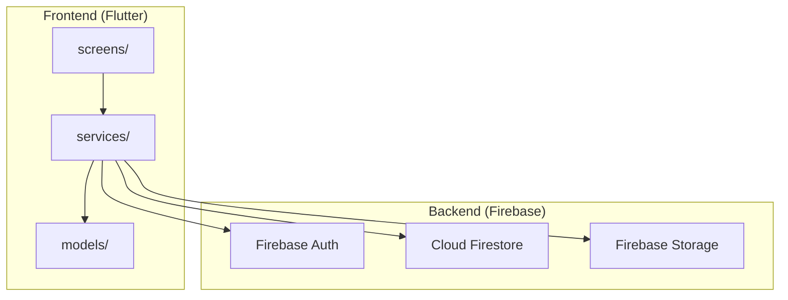
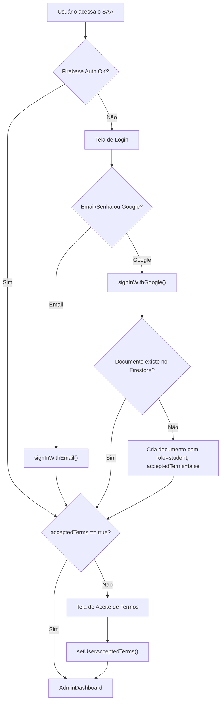
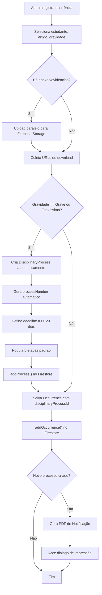
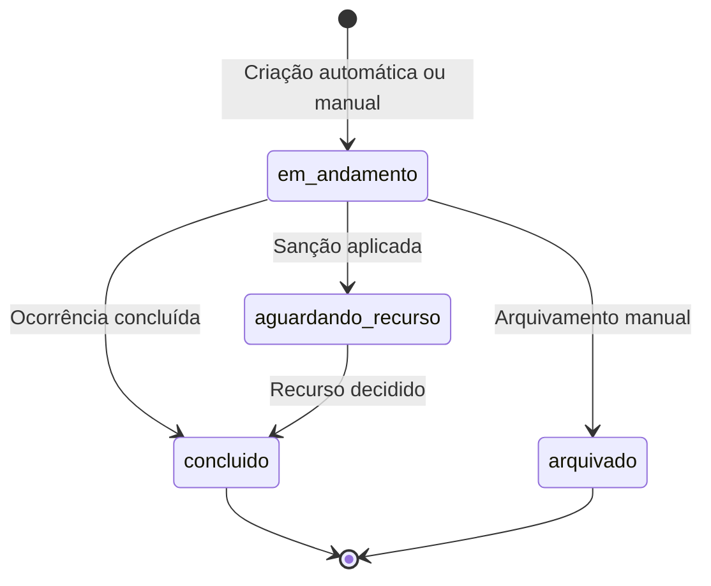

# Relatório Técnico — Camada Lógica de Negócios do SAA v3

**Sistema:** SAA — Sistema de Acompanhamento ao Aluno  
**Versão:** 3.0  
**Instituição:** Instituto Federal de Brasília — Campus Brasília  
**Data:** 26/05/2026  

---

## 1. Visão Geral da Arquitetura

O SAA v3 adota uma **Arquitetura em Camadas (Layered Architecture)** com separação clara entre:

| Camada | Diretório | Responsabilidade |
|---|---|---|
| **Modelos (Data)** | `lib/models/` | Estruturas de dados e serialização |
| **Serviços (Business Logic)** | `lib/services/` | Regras de negócio, autenticação, persistência, armazenamento |
| **Apresentação (UI)** | `lib/screens/` | Telas e interação do usuário |
| **Componentes Reutilizáveis** | `lib/widgets/` | Widgets compartilhados |

O backend é **serverless**, delegado integralmente ao **Firebase** (BaaS — Backend-as-a-Service), utilizando:

- **Firebase Authentication** → identidade e autenticação
- **Cloud Firestore** → banco de dados NoSQL em tempo real
- **Firebase Storage** → armazenamento de arquivos e imagens



---

## 2. Camada de Serviços (Business Logic Layer)

A lógica de negócios é concentrada em **5 serviços** no diretório [services/](file:///d:/saa/saa-v3/lib/services):

### 2.1. AuthService — Autenticação e Gestão de Identidade

**Arquivo:** [auth_service.dart](file:///d:/saa/saa-v3/lib/services/auth_service.dart)  
**Tamanho:** 229 linhas · 8.3 KB

| Método | Assinatura | Descrição |
|---|---|---|
| `user` (getter) | `Stream<AppUser?>` | Stream reativo que combina `authStateChanges()` do Firebase Auth com snapshots do Firestore para manter o estado do usuário sincronizado em tempo real |
| `signInWithEmail` | `Future<AppUser?>(String, String)` | Login via email/senha com tratamento granular de erros (`user-not-found`, `wrong-password`, `user-disabled`, `too-many-requests`, `operation-not-allowed`) |
| `signInWithGoogle` | `Future<AppUser?>()` | Login via Google com fluxo adaptativo: **popup** na web (fallback para **redirect**); lança exceção em plataformas nativas sem `google_sign_in` configurado |
| `signOut` | `Future<void>()` | Encerra a sessão do Firebase Auth |
| `updateUserProfile` | `Future<void>(AppUser)` | Atualiza perfil de usuário no Firestore via `set()` |
| `promoteToAdmin` | `Future<void>(String, String, String)` | Promove um usuário a `admin` criando/atualizando o documento no Firestore |

**Regras de Negócio implementadas:**

- **Auto-provisionamento de usuários:** ao fazer login com Google, se não existir documento no Firestore, cria automaticamente com `role: 'student'` e `acceptedTerms: false`
- **Fallback robusto:** se o Firestore falhar após login com Google, retorna `AppUser` local sem persistir
- **Reatividade:** o getter `user` utiliza `asyncExpand` para compor o stream do Firebase Auth com snapshots do Firestore, garantindo que mudanças no perfil (ex: aceite de termos, promoção a admin) sejam refletidas imediatamente na UI

---

### 2.2. FirestoreService — Persistência e Operações CRUD

**Arquivo:** [firestore_service.dart](file:///d:/saa/saa-v3/lib/services/firestore_service.dart)  
**Tamanho:** 216 linhas · 7.2 KB

Este é o serviço central de acesso a dados. Expõe 4 coleções do Firestore e encapsula todas as operações com tratamento de erro via `_wrap()`.

#### Coleções

| Propriedade | Coleção Firestore | Modelo |
|---|---|---|
| `users` | `users` | `AppUser` |
| `students` | `students` | `Student` |
| `occurrences` | `occurrences` | `Occurrence` |
| `processes` | `processes` | `DisciplinaryProcess` |

#### Operações por Domínio

**Estudantes:**

| Método | Descrição |
|---|---|
| `addStudent(Student)` | Persiste estudante via `set()` com ID explícito |
| `getStudents()` | Lista todos os estudantes (sem paginação) |
| `getStudent(String id)` | Busca estudante por ID |

**Ocorrências:**

| Método | Descrição |
|---|---|
| `addOccurrence(Occurrence)` | Registra ocorrência com ID explícito |
| `getOccurrences()` | Lista ocorrências ordenadas por `createdAt DESC` |
| `getOccurrencesByStudent(String)` | Filtra ocorrências por `studentId`, ordenadas por `createdAt DESC` |
| `updateOccurrenceStatus(String, String)` | Atualiza apenas o campo `status` de uma ocorrência |

**Processos Disciplinares:**

| Método | Descrição |
|---|---|
| `addProcess(DisciplinaryProcess)` | Persiste processo com ID explícito |
| `updateProcess(DisciplinaryProcess)` | Atualiza processo completo via `update()` |
| `getProcesses({int limit})` | Lista processos com limite (padrão: 100), ordenados por `createdAt DESC` |
| `getProcessesByStudent(String)` | Filtra processos por `studentId` |
| `updateProcessFields(String, Map)` | Atualização parcial de campos específicos |

**Administradores:**

| Método | Descrição |
|---|---|
| `getAdmins()` | Lista usuários com `role == 'admin'` |
| `updateAdmin(AppUser)` | Atualiza perfil de admin |
| `updateAdminStatus(String, bool)` | Ativa/desativa admin |

**Estatísticas:**

| Método | Descrição |
|---|---|
| `getStudentStatistics()` | Calcula estatísticas agregadas: total de alunos, distribuição por curso, faixa etária (menores de 18, 18-24, 25-29, 30+), contagem de menores/maiores |

#### Tratamento de Erros

O método privado `_wrap<T>()` intercepta todas as chamadas ao Firestore:

```dart
Future<T> _wrap<T>(Future<T> Function() action) async {
  try {
    return await action();
  } on FirebaseException catch (e) {
    if (e.code == 'unavailable') {
      throw 'Serviço Firestore indisponível...';
    }
    throw 'Erro no Firestore: ${e.message ?? e.code}';
  } catch (e) {
    throw 'Erro no Firestore: $e';
  }
}
```

---

### 2.3. StorageService — Armazenamento de Arquivos

**Arquivo:** [storage_service.dart](file:///d:/saa/saa-v3/lib/services/storage_service.dart)  
**Tamanho:** 112 linhas · 4.0 KB

| Método | Plataforma | Descrição |
|---|---|---|
| `uploadImage(File, String)` | Mobile/Desktop | Upload via `putFile()`; na web, delega para `uploadImageBytes()` |
| `uploadImageBytes(Uint8List, String)` | Todas | Upload via `putData()` com `contentType: image/jpeg` |
| `uploadFileBytes(Uint8List, String, {String?})` | Todas | Upload genérico com content-type configurável |
| `uploadFile(File, String)` | Mobile/Desktop | Upload genérico; na web, delega para `uploadFileBytes()` |
| `deleteImage(String)` | Todas | Exclusão por URL de download |

**Características técnicas:**

- **Timeout de 15 segundos** em todos os uploads
- **Detecção automática de plataforma** (`kIsWeb`): redireciona para upload por bytes quando em ambiente web
- **Retorno de URL de download** após cada upload bem-sucedido
- Mensagens de erro amigáveis em português

---

### 2.4. FirebaseTermsService — Consentimento Regulamentar

**Arquivo:** [firebase_terms_service.dart](file:///d:/saa/saa-v3/lib/services/firebase_terms_service.dart)  
**Tamanho:** 77 linhas · 2.4 KB

| Método | Descrição |
|---|---|
| `hasUserAcceptedTerms()` | Verifica se o campo `acceptedTerms` é `true` no documento do usuário |
| `setUserAcceptedTerms()` | Marca `acceptedTerms: true` e registra `acceptedAt` com `FieldValue.serverTimestamp()` usando `SetOptions(merge: true)` |
| `getRegulationText()` | Busca texto do regulamento na coleção `appConfig/regulation`; se indisponível, retorna texto padrão hardcoded |

**Regras de Negócio:**

- **Bloqueio de acesso:** usuários que não aceitaram os termos são redirecionados para a tela de aceite antes de acessar qualquer funcionalidade (controlado pelo `AuthWrapper` em [main.dart](file:///d:/saa/saa-v3/lib/main.dart#L156-L158))
- **Registro de auditoria:** o timestamp do aceite é gravado com `FieldValue.serverTimestamp()` para fins de conformidade LGPD
- **Merge strategy:** utiliza `SetOptions(merge: true)` para não sobrescrever outros campos do documento

---

### 2.5. PdfService — Geração de Documentos

**Arquivo:** [pdf_service.dart](file:///d:/saa/saa-v3/lib/services/pdf_service.dart)  
**Tamanho:** 132 linhas · 5.5 KB

| Método | Descrição |
|---|---|
| `generateAndPrintProcessNotification(...)` | Gera e imprime notificação formal de processo disciplinar em PDF A4 |

**Conteúdo do documento gerado:**

1. **Cabeçalho:** "NOTIFICAÇÃO DE PROCESSO DISCIPLINAR"
2. **Corpo:** texto formal com número do processo e classificação de gravidade
3. **Bloco "Identificação do Discente":** nome, matrícula, curso, responsável legal (se menor)
4. **Bloco "Dados da Ocorrência":** data, artigo violado, gravidade, descrição dos fatos
5. **Cláusula de notificação:** menção a ampla defesa e contraditório
6. **Assinatura:** nome do responsável no câmpus
7. **Rodapé:** data/hora de geração com marca do SAA

---

## 3. Camada de Modelos (Data Layer)

Os modelos estão em [models/](file:///d:/saa/saa-v3/lib/models) e todos implementam:
- `toMap()` — serialização para Firestore
- `fromMap()` factory — deserialização do Firestore
- `parseDate()` interno — parser polimórfico que aceita `Timestamp`, `int` (milliseconds) e `String`

### 3.1. AppUser

**Arquivo:** [user_model.dart](file:///d:/saa/saa-v3/lib/models/user_model.dart) (60 linhas)

| Campo | Tipo | Descrição |
|---|---|---|
| `uid` | `String` | ID do Firebase Auth |
| `email` | `String` | Email do usuário |
| `name` | `String` | Nome de exibição |
| `role` | `String` | Papel: `admin`, `professor`, `student` |
| `photoUrl` | `String?` | URL da foto de perfil |
| `createdAt` | `DateTime` | Data de criação |
| `isActive` | `bool` | Status ativo/inativo (padrão: `true`) |
| `acceptedTerms` | `bool` | Aceite do regulamento (padrão: `false`) |
| `acceptedAt` | `DateTime?` | Data/hora do aceite |

### 3.2. Student

**Arquivo:** [student_model.dart](file:///d:/saa/saa-v3/lib/models/student_model.dart) (68 linhas)

| Campo | Tipo | Descrição |
|---|---|---|
| `id` | `String` | ID do documento |
| `name` | `String` | Nome completo |
| `email` | `String` | Email |
| `registration` | `String` | Matrícula institucional |
| `course` | `String` | Curso |
| `photoUrl` | `String?` | URL da foto |
| `birthDate` | `DateTime` | Data de nascimento |
| `legalGuardian` | `String?` | Nome do responsável legal |
| `guardianPhone` | `String?` | Telefone do responsável |
| `isMinor` | `bool` | Indicador de menor de idade |
| `createdAt` | `DateTime` | Data de criação |

### 3.3. Occurrence

**Arquivo:** [occurrence_model.dart](file:///d:/saa/saa-v3/lib/models/occurrence_model.dart) (80 linhas)

| Campo | Tipo | Descrição |
|---|---|---|
| `id` | `String` | ID do documento |
| `studentId` | `String` | FK para o estudante |
| `studentName` | `String` | Nome denormalizado do estudante |
| `reportedBy` | `String` | Nome de quem reportou |
| `reporterId` | `String` | ID de quem reportou |
| `date` | `DateTime` | Data do fato |
| `article` | `String` | Artigo do regulamento violado |
| `description` | `String` | Descrição dos fatos |
| `severity` | `String` | `leve`, `grave`, `gravissima` |
| `status` | `String` | `pendente`, `em_analise`, `concluido` |
| `evidenceUrls` | `List<String>` | URLs dos anexos/evidências |
| `disciplinaryProcessId` | `String?` | FK para processo disciplinar |
| `createdAt` | `DateTime` | Data de criação |

### 3.4. DisciplinaryProcess

**Arquivo:** [process_model.dart](file:///d:/saa/saa-v3/lib/models/process_model.dart) (264 linhas)

O modelo mais complexo do sistema, com:

**Campos:**

| Campo | Tipo | Descrição |
|---|---|---|
| `id` | `String` | ID do documento |
| `processNumber` | `String` | Número gerado automaticamente (ex: `PROC-20260526-12345`) |
| `studentId` | `String` | FK para o estudante |
| `studentName` | `String` | Nome denormalizado |
| `occurrenceIds` | `List<String>` | FKs para ocorrências vinculadas |
| `createdAt` | `DateTime` | Data de criação |
| `deadline` | `DateTime?` | Prazo de conclusão |
| `status` | `String` | `em_andamento`, `aguardando_recurso`, `concluido`, `arquivado` |
| `sanction` | `String?` | `advertencia`, `suspensao`, `desligamento` |
| `sanctionAppliedAt` | `DateTime?` | Data de aplicação da sanção |
| `steps` | `List<ProcessStep>` | Etapas do processo |
| `appealDecision` | `String?` | Decisão do recurso |
| `appealDecidedAt` | `DateTime?` | Data da decisão do recurso |
| `createdBy` | `String?` | Autor da criação |

**Getters calculados (Prazos Regulamentares):**

| Getter | Cálculo | Descrição |
|---|---|---|
| `processDeadline` | `createdAt + 20 dias` | Prazo máximo para conclusão do processo |
| `appealDeadline` | `sanctionAppliedAt + 5 dias` | Prazo para entrada de recurso |
| `appealResponseDeadline` | `sanctionAppliedAt + 10 dias` | Prazo para resposta ao recurso |
| `isOverdue` | `deadline < now` | Indica se o prazo foi ultrapassado |
| `canAppeal` | `sanction != null && appealDecision == null` | Indica se o recurso é possível |
| `isActive` | `status in ['em_andamento', 'aguardando_recurso']` | Indica se o processo está ativo |

**Subclasses auxiliares:**

- **`ProcessStep`** — etapa individual do processo (nome, data, descrição, responsável, status de conclusão, notas)
- **`DefaultProcessSteps`** — template com 5 etapas padrão:
  1. Instauração do Processo (D+0)
  2. Audiência Preliminar (D+2)
  3. Coleta de Provas e Depoimentos (D+5)
  4. Relatório Final (D+15)
  5. Julgamento (D+18)

- **`Sanctions`** — sanções disponíveis com mapeamento por gravidade:

| Gravidade | Sanções Aplicáveis |
|---|---|
| Leve | Advertência |
| Grave | Advertência, Suspensão |
| Gravíssima | Suspensão, Desligamento |

---

## 4. Regras de Negócio e Fluxos Automatizados

### 4.1. Fluxo de Autenticação e Controle de Acesso



### 4.2. Fluxo de Registro de Ocorrência com Automação de Processo



> [!IMPORTANT]
> **Regra crítica (RF07):** Ocorrências classificadas como **Grave** ou **Gravíssima** disparam **automaticamente** a criação de um Processo Disciplinar completo, com número, prazo de 20 dias e 5 etapas pré-definidas.

### 4.3. Classificação de Artigos Regulamentares

O sistema codifica 34 artigos do Regulamento Discente do IFB organizados em 3 níveis de gravidade:

| Gravidade | Artigos | Quantidade |
|---|---|---|
| **Leve** | Art. 5º (I–VIII), Art. 6º (I–IV) | 12 artigos |
| **Grave** | Art. 6º (V–XIII) | 9 artigos |
| **Gravíssima** | Art. 6º (XIV–XXIV) | 11 artigos |

Esta tabela está hardcoded em [occurrence_management.dart](file:///d:/saa/saa-v3/lib/screens/occurrence_management.dart#L14-L53) como `_kViolationArticles`.

### 4.4. Ciclo de Vida do Processo Disciplinar



---

## 5. Gerenciamento de Estado

O SAA v3 utiliza o pacote **Provider** para injeção de dependência:

```dart
// main.dart
MultiProvider(
  providers: [
    Provider<AuthService>(create: (_) => AuthService()),
  ],
  child: MaterialApp(...)
)
```

O `AuthWrapper` consome o stream `authService.user` via `StreamBuilder<AppUser?>`, reagindo a:
- **Erro** → tela de erro com botão de logout
- **Loading** → splash screen com logo do IFB
- **Dados (`!acceptedTerms`)** → tela de aceite de termos
- **Dados (`acceptedTerms`)** → dashboard principal

> [!NOTE]
> Os serviços `FirestoreService`, `StorageService` e `PdfService` são instanciados diretamente nas telas (sem injeção via Provider), o que é um ponto de acoplamento.

---

## 6. Configurações de Infraestrutura

### Firebase (Web)

| Parâmetro | Comportamento |
|---|---|
| Persistência local | **Desabilitada na web** (`persistenceEnabled: false`) para evitar problemas com IndexedDB bloqueado |
| Projeto ID | `auth-b8a9a` |
| Plataformas | Web, Android, iOS, Windows, Linux, macOS |

### Dependências de Backend

| Pacote | Versão | Função |
|---|---|---|
| `firebase_core` | ^4.5.0 | Inicialização Firebase |
| `firebase_auth` | ^6.2.0 | Autenticação |
| `cloud_firestore` | ^6.1.3 | Banco de dados |
| `firebase_storage` | ^13.1.0 | Armazenamento de arquivos |
| `firebase_database` | ^12.1.4 | Realtime Database (declarado mas não utilizado nos serviços) |
| `provider` | ^6.1.1 | Gerenciamento de estado |
| `pdf` | ^3.12.0 | Geração de PDFs |
| `printing` | ^5.14.3 | Impressão de PDFs |
| `barcode_widget` | ^2.0.4 | Geração de códigos de barras |
| `file_picker` | ^10.3.10 | Seleção de arquivos |
| `url_launcher` | ^6.1.12 | Abertura de URLs externas |
| `intl` | ^0.20.2 | Internacionalização e formatação |

---

## 7. Tratamento de Erros e Resiliência

| Camada | Estratégia |
|---|---|
| **AuthService** | `try/catch` com mapeamento de códigos Firebase Auth para mensagens PT-BR amigáveis |
| **FirestoreService** | `_wrap()` genérico captura `FirebaseException` e mapeia `unavailable` para mensagem específica |
| **StorageService** | Timeout de 15s em uploads; mensagens em PT-BR |
| **OccurrenceManagement** | Timeout de 120s no upload de evidências; timeout de 10s nas operações Firestore |
| **ProcessManagement** | Timeout de 15s na listagem de processos; limite de 50 registros |
| **Login (Google)** | Fallback automático popup → redirect; fallback Firestore indisponível |

---

## 8. Conformidade e Auditoria (LGPD)

| Requisito | Implementação |
|---|---|
| **Registro de consentimento** | Campo `acceptedAt` com `FieldValue.serverTimestamp()` |
| **Bloqueio sem consentimento** | `AuthWrapper` redireciona para `TermsOfAgreementScreen` se `acceptedTerms == false` |
| **Regulamento configurável** | Texto buscado da coleção `appConfig/regulation` no Firestore, com fallback local |
| **Segurança** | Delegada às Firebase Security Rules (RNF02) |

---

## 9. Pontos de Atenção e Recomendações

> [!WARNING]
> ### Questões identificadas na camada de negócios

| # | Problema | Severidade | Recomendação |
|---|---|---|---|
| 1 | **Instanciação direta de serviços nas telas** — `FirestoreService()` e `StorageService()` são criados localmente em vez de injetados via Provider | Média | Registrar todos os serviços no `MultiProvider` para facilitar testes e desacoplamento |
| 2 | **`reportedBy` e `reporterId` hardcoded** — nas ocorrências, sempre `'Administrador'` e `'admin'` em vez do usuário logado | Alta | Passar o `AppUser` logado para a tela e usar `user.name`/`user.uid` |
| 3 | **`getStudents()` sem paginação** — carrega todos os registros de uma vez | Média | Implementar paginação com `startAfterDocument` ou limite + cursor |
| 4 | **`firebase_database` declarado mas não utilizado** — dependência desnecessária | Baixa | Remover do `pubspec.yaml` se não planejado |
| 5 | **Tabela de artigos hardcoded na UI** — `_kViolationArticles` está em `occurrence_management.dart` | Média | Extrair para um arquivo de constantes em `models/` ou buscar do Firestore |
| 6 | **Ausência de testes unitários** — nenhum teste encontrado no projeto | Alta | Criar testes para os 5 serviços e os 4 modelos |
| 7 | **Modelos imutáveis sem `copyWith`** em `AppUser`, `Student` e `Occurrence` | Baixa | Adicionar `copyWith()` para consistência (já existe em `DisciplinaryProcess` e `ProcessStep`) |
| 8 | **Denormalização de `studentName`** em ocorrências e processos | Baixa | Aceitável em Firestore para performance de leitura, mas requer lógica de sincronização se nomes forem editados |

---

## 10. Resumo Quantitativo

| Métrica | Valor |
|---|---|
| **Serviços (camada de negócio)** | 5 |
| **Modelos de dados** | 4 (+2 subclasses) |
| **Coleções Firestore** | 4 (+1 config) |
| **Métodos públicos nos serviços** | 24 |
| **Artigos regulamentares codificados** | 34 |
| **Etapas padrão de processo** | 5 |
| **Sanções disponíveis** | 3 |
| **Total de linhas (serviços)** | ~766 |
| **Total de linhas (modelos)** | ~472 |
| **Backend (Firebase)** | 100% serverless |
